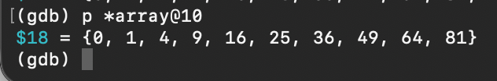
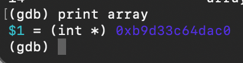

# Отчет по первой программе
После компиляции программы с отладочными символами можно использовать gdb, чтобы увидеть принцип работы программы.

После пропуска нескольких этапов работы программы (цикл) можно увидеть содержимое массива.

После освобождения памяти можно увидеть, что память действительно освободилась.

При обычном выполнении программы необходимо ввести длину массива, если длина превышает допустимые значения, то выводится ошибка.

